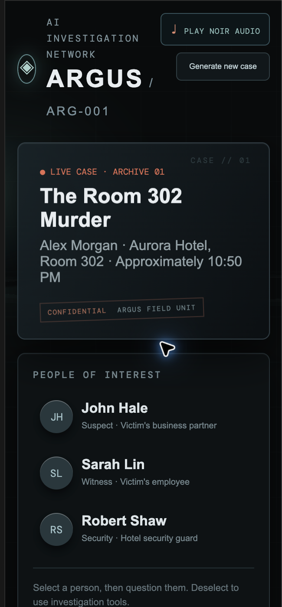

# Project ARGUS

ARGUS is a playable AI detective-game MVP. A case is generated when a game starts, NPCs answer from their own memories, investigation tools reveal evidence, and the final accusation is scored against the hidden solution.

## Live demo

Open the deployed detective console: **https://argus-orcin-alpha.vercel.app/**

Vercel project: **https://vercel.com/khush-415b/argus**

### Main detective console



The interface uses a noir palette, evidence-board layout, suspect interviews, tool-driven investigation, and a browser-generated ambient soundtrack for a Sherlock-inspired mood.

## Run locally

Important: do not double-click `frontend/index.html`. That opens it as `file://` and browsers cannot load the React module imports or connect to the API. From the ARGUS folder, run:

```bash
chmod +x start.sh
./start.sh
```

Then open <http://localhost:5173>.

The header's `PLAY NOIR AUDIO` button starts a generated, low-volume Sherlock-style ambient drone using the browser Web Audio API. Browsers require a click before audio can start; use that button once after opening the page.

### Backend

```bash
python3 -m venv .venv
source .venv/bin/activate
pip install -r backend/requirements.txt
uvicorn backend.app.main:app --reload --port 8000
```

### Frontend

```bash
cd frontend
npm install
npm run dev
```

Open <http://localhost:5173>. API docs are at <http://localhost:8000/docs>.

The current MVP is deliberately self-contained: it demonstrates supervisor routing, NPC memory retrieval, tool calls, persistent game state, contradictions, evidence collection, and accusation evaluation without requiring an API key. The backend is structured so an LLM, LangGraph, Qdrant, PostgreSQL, and a standalone MCP server can be added incrementally.

## Tests

```bash
python3 -m pytest backend/tests
```

## Main API

- `POST /api/games` — generate a fresh case
- `GET /api/games/{id}` — read the public game state
- `POST /api/games/{id}/actions` — question an NPC or ask the supervisor to use a tool
- `POST /api/games/{id}/accusations` — submit the final theory
- `GET /health` — service health

## Example actions

- `Where were you at 10:00 PM?` (select an NPC)
- `Check the lobby CCTV`
- `Analyze the fingerprint from Room 302`
- `Search police records for a suspect`
